# CLASS.md — 汎用自動継続開発ランナーのクラス設計

対象: `SPEC.md` v0.1.0 / `SEQUENCE.md`
実装言語: Python 3.11 以上(Controller)。SPEC §4 の構成要素をそのままクラスへ対応させる。

---

## 1. クラス図

```mermaid
classDiagram
    class AutoLoopController {
        -config: Config
        -state_store: StateStore
        -lock: LockManager
        -synchronizer: RepositorySynchronizer
        -planner: Planner
        -session_manager: SessionManager
        -verifier: Verifier
        -publisher: GitPublisher
        -classifier: FailureClassifier
        -logger: RunLogger
        +run() ControllerState
        -run_one_task() NextDecision
        -transition(state: ControllerState) void
        -stop(reason: str) void
    }

    class Config {
        +repo_path: str
        +automation_dir: str
        +max_tasks_per_run: int
        +max_resume_count: int
        +transient_retry_waits: list~int~
        +preferred_executor: str
        +fallback_executor: str
        +load(path: str) Config
    }

    class StateStore {
        +state: ControllerRunState
        +load() ControllerRunState
        +save(state: ControllerRunState) void
        +record_result_commit(task_id: str, sha: str) void
    }

    class ControllerRunState {
        +protocol_version: int
        +controller_state: ControllerState
        +current_task_id: str
        +current_executor: str
        +claude_session_id: str
        +codex_session_id: str
        +planner_session_id: str
        +resume_count: int
        +task_count_in_session: int
        +last_instruction_sha256: str
        +last_result_sha256: str
    }

    class LockManager {
        +acquire(task_id: str) bool
        +release() void
        +is_stale() bool
        +clear_stale() void
    }

    class RepositorySynchronizer {
        -git: GitClient
        +sync_and_preflight(instruction: InstructionDocument) PreflightResult
    }

    class GitClient {
        +status_short() list~str~
        +fetch(remote: str, branch: str) void
        +pull_ff_only() bool
        +rev_parse(ref: str) str
        +diff_check() bool
        +diff_name_only() list~str~
        +log(n: int) list~str~
        +add_paths(paths: list~str~) void
        +commit(message: str) str
        +push(remote: str, branch: str) bool
    }

    class InstructionDocument {
        +front_matter: InstructionFrontMatter
        +body: str
        +parse(path: str) InstructionDocument
        +sha256() str
    }

    class InstructionFrontMatter {
        +protocol_version: int
        +task_id: str
        +task_revision: int
        +status: TaskStatus
        +expected_base_commit: str
        +preferred_executor: str
        +fallback_executor: str
        +session_policy: str
        +allow_flags: dict
        +max_resume_count: int
        +max_wall_minutes: int
        +commit_message: str
        +required_tests: list~str~
        +allowed_paths: list~str~
    }

    class ResultDocument {
        +parse_latest_block(path: str, task_id: str) ResultBlock
        +is_partial_block(path: str, task_id: str) bool
    }

    class ResultBlock {
        +protocol_version: int
        +task_id: str
        +status: TaskStatus
        +executor: str
        +session_id: str
        +base_commit: str
        +result_commit: str
        +tests: list~TestResult~
        +changed_files: list~str~
        +live_executed: bool
        +next_recommendation: str
    }

    class Planner {
        -runner: AgentRunner
        -prompt_builder: PromptBuilder
        +plan() PlannerResult
        +validate(result: PlannerResult) bool
    }

    class PlannerResult {
        +decision: Decision
        +next_task_id: str
        +reason: str
    }

    class AgentRunner {
        <<interface>>
        +start(prompt: str) AgentOutcome
        +resume(session_id: str, prompt: str) AgentOutcome
    }

    class CodexRunner {
        +start(prompt: str) AgentOutcome
        +resume(session_id: str, prompt: str) AgentOutcome
    }

    class ClaudeRunner {
        +start(prompt: str) AgentOutcome
        +resume(session_id: str, prompt: str) AgentOutcome
    }

    class AgentOutcome {
        +exit_code: int
        +session_id: str
        +stdout_events: list~dict~
        +stderr_text: str
    }

    class SessionManager {
        -state_store: StateStore
        -config: Config
        +should_rotate() bool
        +run_executor(instruction: InstructionDocument) AgentOutcome
        -select_runner(name: str) AgentRunner
    }

    class PromptBuilder {
        +planner_prompt() str
        +executor_prompt(instruction: InstructionDocument) str
        +resume_prompt() str
        +handoff_prompt(classification: FailureKind, done: list~str~, remaining: list~str~) str
    }

    class Verifier {
        -git: GitClient
        +verify(instruction: InstructionDocument, outcome: AgentOutcome) VerifyResult
        -verify_files(allowed_paths: list~str~) bool
        -verify_tests(required_tests: list~str~, block: ResultBlock) bool
        -verify_git() bool
    }

    class GitPublisher {
        -git: GitClient
        +publish(instruction: InstructionDocument, changed_files: list~str~) PublishResult
    }

    class FailureClassifier {
        +classify(outcome: AgentOutcome) FailureKind
    }

    class RunLogger {
        +log_dir: str
        +controller_log(message: str) void
        +save_agent_output(outcome: AgentOutcome) void
        +save_git_snapshot(label: str, text: str) void
        +save_result_json(data: dict) void
    }

    class ControllerState {
        <<enumeration>>
        IDLE
        SYNCING
        PREFLIGHT
        PLANNING
        PLAN_VERIFY
        EXECUTING
        RESULT_VERIFY
        COMMITTING
        PUSHING
        NEXT_DECISION
        PAUSED_USAGE_LIMIT
        PAUSED_CONTEXT_LIMIT
        PAUSED_TRANSIENT_ERROR
        PAUSED_DIRTY_WORKTREE
        STOPPED
    }

    class TaskStatus {
        <<enumeration>>
        draft
        ready
        running
        completed
        approval_required
        blocked
        failed
        release_ready
    }

    class Decision {
        <<enumeration>>
        ready
        approval_required
        blocked
        release_ready
    }

    class FailureKind {
        <<enumeration>>
        none
        usage_limit
        context_limit
        transient_error
        authentication_error
        safety_classifier_unavailable
        unexpected_change
        test_failure
    }

    AutoLoopController --> Config
    AutoLoopController --> StateStore
    AutoLoopController --> LockManager
    AutoLoopController --> RepositorySynchronizer
    AutoLoopController --> Planner
    AutoLoopController --> SessionManager
    AutoLoopController --> Verifier
    AutoLoopController --> GitPublisher
    AutoLoopController --> FailureClassifier
    AutoLoopController --> RunLogger
    StateStore --> ControllerRunState
    RepositorySynchronizer --> GitClient
    RepositorySynchronizer --> InstructionDocument
    InstructionDocument --> InstructionFrontMatter
    ResultDocument --> ResultBlock
    Planner --> PlannerResult
    Planner --> AgentRunner
    Planner --> PromptBuilder
    SessionManager --> AgentRunner
    SessionManager --> StateStore
    SessionManager --> PromptBuilder
    AgentRunner <|.. CodexRunner
    AgentRunner <|.. ClaudeRunner
    AgentRunner --> AgentOutcome
    Verifier --> GitClient
    Verifier --> ResultDocument
    GitPublisher --> GitClient
    FailureClassifier --> FailureKind
    AutoLoopController --> ControllerState
    InstructionFrontMatter --> TaskStatus
    PlannerResult --> Decision
```

---

## 2. 責務一覧

| クラス | SPEC 対応 | 責務 |
|---|---|---|
| AutoLoopController | §4, §8 | 状態遷移の統括。1 起動で最大 `max_tasks_per_run` タスク。停止時は必ず state 記録と lock 解放を行う |
| Config | §5 | `config.json` の読み込み。executor 構成・上限値(§25 の初期値: 最大連続タスク1、最大resume 2) |
| StateStore / ControllerRunState | §10.1 | `state.json` の読み書き。session ID・resume_count・result_commit の記録(QandA Q-03) |
| LockManager | §20 | `runner.lock` の作成・解放・stale 判定(PID 生存確認) |
| RepositorySynchronizer | §9 | git status / fetch / pull --ff-only / HEAD 一致確認と、既存指示書の ready・base_commit・二重実行検査(QandA Q-04)。自動復旧はしない |
| GitClient | §9, §15 | git コマンドの薄いラッパ。`add .`・`-A`・`commit -a`・`push --force` に相当する API を持たない |
| InstructionDocument / InstructionFrontMatter | §6 | instructions.md の YAML Front Matter 解析・検証・sha256 |
| ResultDocument / ResultBlock | §7 | result.md の機械可読ブロック解析。最新の完全なブロックだけを読み、開始マーカーのみは途中書き込みと判定 |
| Planner / PlannerResult | §12 | Planner Agent の起動と結果の Schema 検証。decision は 4 値のみ。複数タスクの同時 ready を拒否 |
| AgentRunner / CodexRunner / ClaudeRunner | §11 | 非対話起動・session ID 取得・ID 明示 resume。プロンプトは stdin / ファイル参照で渡す |
| AgentOutcome | §16 | exit code・session ID・構造化 stdout・stderr を保持し分類の入力になる |
| SessionManager | §10 | resume / rotation 判定(§10.4 の 7 条件)、executor と fallback の選択 |
| PromptBuilder | §5, §10.3, §17 | prompts\ 配下のテンプレートから planner / executor / resume / handoff プロンプトを生成 |
| Verifier | §14 | ファイル(allowed_paths・禁止ファイル・結果ブロック完全性)、テスト(全実行・exit 0・件数一致)、Git の3観点検証 |
| GitPublisher | §15 | 許可された個別ファイルのみ stage → commit → push → HEAD/origin 一致確認 |
| FailureClassifier / FailureKind | §16 | 終了コード+構造化 stdout+stderr+Git 状態からの障害分類 |
| RunLogger | §5, §21 | `logs\YYYYMMDD-HHMMSS\` への記録。秘密情報(APIキー・token・生プロンプト全文等)は保存しない。リポジトリ内には書かない |

---

## 3. 設計上の注意

- Git 操作は GitClient 経由に限定し、AI Agent(Planner/Executor)には Git 書き込み操作をさせない(SPEC §2.3)。
- 破壊的操作(reset / stash / clean / force push / ファイル削除)は GitClient に実装しない。必要になった場合は `approval_required` で停止する(SPEC §3.2)。
- `ResultBlock.result_commit` は Executor 記入時点では null。確定 SHA は `StateStore.record_result_commit()` と `RunLogger.save_result_json()` が保持する(QandA Q-03)。
- Phase 1(MVP 最初期)では Planner クラスは未実装でよい。RepositorySynchronizer の指示書検査だけで動作する(QandA Q-01)。
