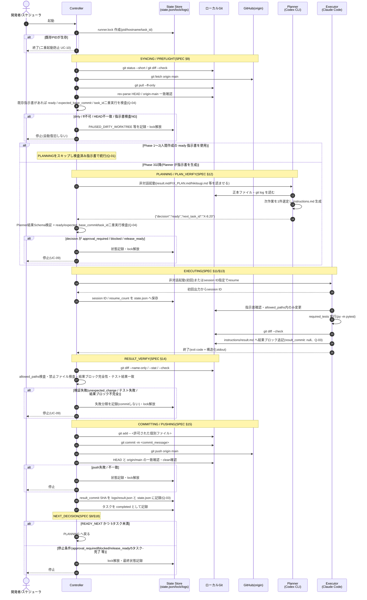
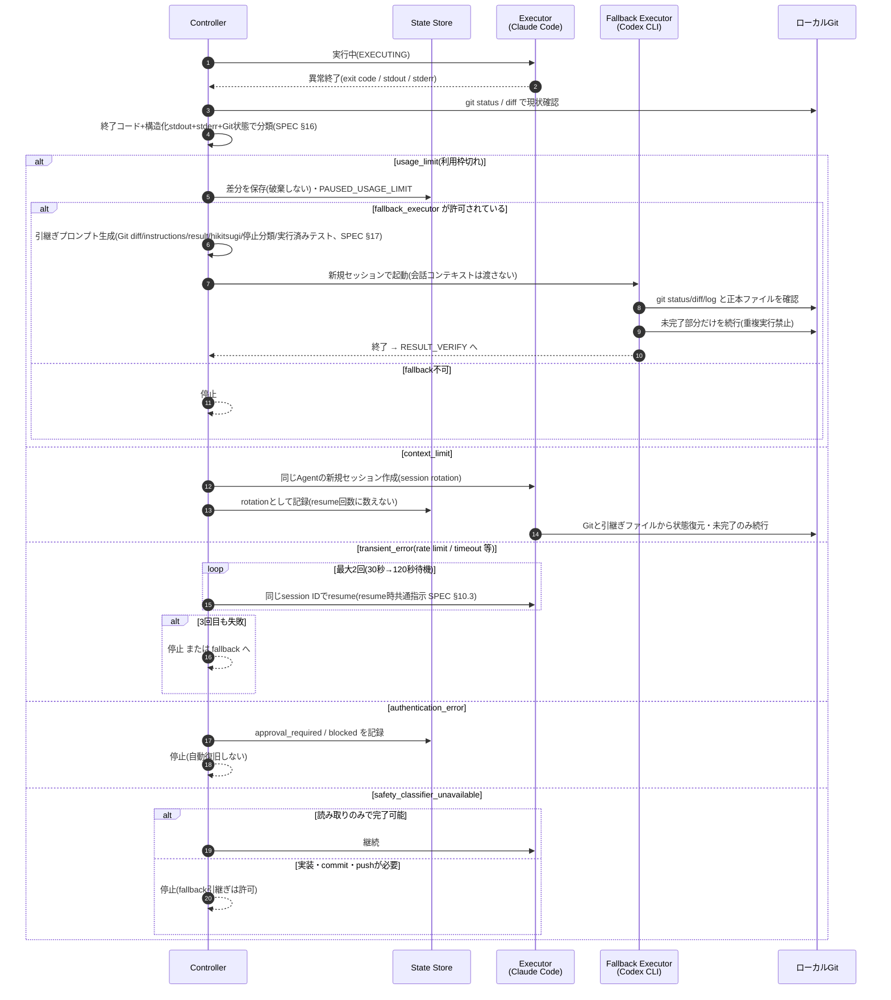
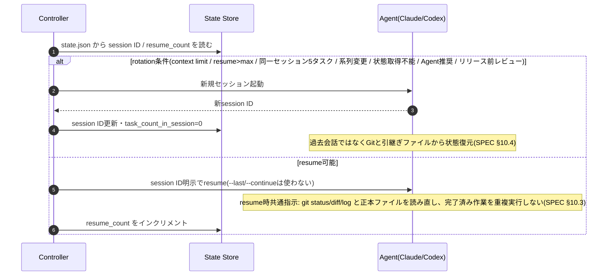

# SEQUENCE.md — 汎用自動継続開発ランナーのシーケンス設計

対象: `SPEC.md` v0.1.0 / `USECASE.md`
前提: QandA Q-01(Phase 1〜2 は人間が指示書作成)、Q-03(`result_commit` は Executor 時点で null)、Q-04(ready 検査は PREFLIGHT と PLAN_VERIFY の両方)

---

## 1. メインフロー(1タスクの正常系)

UC-01/UC-02/UC-03/UC-04/UC-05/UC-06 に対応する。SPEC §8 の状態遷移(IDLE→SYNCING→PREFLIGHT→PLANNING→PLAN_VERIFY→EXECUTING→RESULT_VERIFY→COMMITTING→PUSHING→NEXT_DECISION)を1本のシーケンスで表す。

---

## 2. 障害分類と fallback(UC-07 / UC-08)

SPEC §16(利用枠切れと障害分類)・§17(Agent間引継ぎ)・§10(セッション管理)の分岐。

---

## 3. セッション resume / rotation(UC-07)

---

## 4. 補足

- 図1の Planner 起動(PLANNING)は Phase 3 以降。Phase 1〜2 では開発者が事前に `status: ready` の指示書を commit しておき、PREFLIGHT で検査する(QandA Q-01/Q-04)。
- live 実行を含むタスクは Planner が `approval_required` を返して停止し、人間が承認済み指示書 revision を commit するまで進まない(SPEC §19、UC-11)。失敗した live 実行は resume/fallback で自動再試行しない。
- 図2の fallback 起動は常に新規セッションで行い、前 Agent の会話コンテキストは渡さない(SPEC §17)。
- Controller はどの経路で停止する場合も、最終状態を state.json・logs に記録したうえで `runner.lock` を解放してから終了する(図2の各停止分岐にも適用)。PAUSED_* での停止も同様で、再開時は新しい Controller 起動が lock を取り直す。プロセス異常終了で残った lock は stale lock として解除できる(SPEC §20)。
