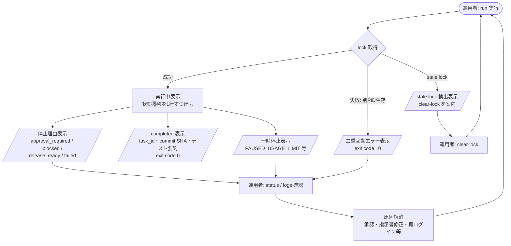

# UI.md — 汎用自動継続開発ランナーのユーザーインターフェース設計

対象: `USECASE.md` / `SEQUENCE.md`
本システムは GUI を持たない CLI ツール(Python Controller)である。UI は次の3要素で構成する。

1. コンソール(PowerShell)のコマンドと出力
2. 終了時のステータス表示と exit code
3. 状態確認用ファイル(state.json / logs / result.md)

Web ダッシュボードや通知は将来拡張(SPEC §26)であり本書の対象外。

---

## 1. コマンド体系

| コマンド | 対応UC | 説明 |
|---|---|---|
| `py -m oracle_autoloop run` | UC-01 | 1回の自動開発サイクルを実行(既定: 最大1タスク、SPEC §25) |
| `py -m oracle_autoloop run --max-tasks 5` | UC-01 | 最大タスク数を上書き(上限5、SPEC §18) |
| `py -m oracle_autoloop status` | UC-12 | state.json と lock の内容を整形表示(読み取りのみ) |
| `py -m oracle_autoloop clear-lock` | UC-10 | stale lock の解除(PID 生存時は拒否。ログに記録) |
| `py -m oracle_autoloop --version` | - | バージョン表示 |

- 設定は `<AUTOMATION_ROOT>\config.json` から読む。存在しない場合は起動エラー(§4 参照)。
- Phase 5 では Windows タスクスケジューラが `run` を起動する。

---

## 2. 運用者の操作フロー(画面遷移相当)



---

## 3. コンソール出力仕様

### 3.1 実行中(1行1イベント)

```text
[13:00:01] STATE  SYNCING        git pull --ff-only: up to date
[13:00:03] STATE  PREFLIGHT      HEAD=cd8422e origin/main=cd8422e clean
[13:00:03] STATE  PREFLIGHT      instructions: task_id=X-8.20 status=ready
[13:00:05] STATE  EXECUTING      executor=claude session=xxxxxxxx... (new)
[13:25:40] STATE  RESULT_VERIFY  tests: py -m pytest exit=0 (291 passed)
[13:25:45] STATE  COMMITTING     3 files staged
[13:25:50] STATE  PUSHING        origin/main updated: abcdef1
[13:25:51] DONE   X-8.20 completed (1/1 tasks)
```

- 秘密情報(APIキー・token・生プロンプト全文)は表示しない(SPEC §21)。
- 詳細は `logs\YYYYMMDD-HHMMSS\controller.log` に同内容+付加情報を記録する。

### 3.2 終了時サマリ

```text
== 自動継続開発ランナー終了 ==
結果      : completed | approval_required | blocked | release_ready | failed | paused
task_id   : X-8.20
commit    : abcdef1 (HEAD == origin/main)
テスト    : py -m pytest exit=0 291 passed
停止理由  : (停止時のみ。例: live評価には明示承認が必要)
次の操作  : (案内。例: QandA.md を確認し指示書 revision を commit してください)
ログ      : <AUTOMATION_ROOT>\logs\20260714-130001\
```

---

## 4. exit code 体系

| exit code | 意味 | 分類 |
|---|---|---|
| 0 | 全タスク completed | 正常 |
| 1 | failed(テスト失敗・検証失敗・push失敗など) | 異常停止 |
| 2 | approval_required で停止 | 判断待ち |
| 3 | blocked で停止 | 判断待ち |
| 4 | release_ready で停止 | 判断待ち |
| 5 | PAUSED_*(usage_limit / context_limit / transient / dirty) | 一時停止 |
| 10 | 二重起動(lock 取得失敗) | 起動不可 |
| 11 | 設定エラー(config.json 不在・不正) | 起動不可 |
| 12 | preflight 失敗(dirty / HEAD不一致 / 指示書検査NG) | 起動不可 |
| 13 | stale lock 検出(自動解除せず停止) | 起動不可 |
| 14 | 状態ファイル破損(state.json / runner.lock が不正JSON・読み取り不可) | 起動不可 |

タスクスケジューラや上位スクリプトはこの exit code で後続動作を分岐できる。

---

## 5. 例外状態の表示

| 状態 | 表示・挙動 |
|---|---|
| 指示書なし / status≠ready | `ERROR: 実行可能な指示書がありません (instructions/instructions.md: status=draft)` を表示し exit 12。復旧手順(指示書を ready にして commit)を1行案内 |
| dirty worktree | 変更ファイル一覧(名前のみ)を表示し exit 12。「自動復旧は行いません。手動で確認してください」と明示(SPEC §9) |
| usage_limit | `PAUSED: Claude 利用枠切れを検出。差分は保護されています` を表示。fallback 実行時は `fallback: codex へ引継ぎ中` を続けて表示 |
| authentication_error | `ERROR: 認証エラー。自動復旧しません。claude /login 等で再認証してください` を表示し exit 5 |
| unexpected_change | allowed_paths 外の変更ファイル一覧を表示し、commit していないことを明示して exit 1 |
| result.md 途中書き込み | `ERROR: X-8.20 の結果ブロックが不完全です(終了マーカーなし)。自動続行しません` を表示し exit 1(SPEC §7) |
| stale lock | lock 内の pid / started_at / task_id を表示し、`clear-lock` の実行を案内して exit 13(自動解除はしない) |
| state.json / runner.lock が破損(不正JSON・読み取り権限なし) | `ERROR: state.json を解析できません` 等を表示し exit 14。上書き・削除はせず、破損ファイルのパスを案内する。`status` コマンドも同様の表示で exit 14 |
| status コマンドで state.json 不在 | `state.json がありません(初回実行前)` と表示し exit 0(空状態) |
| fetch / pull / push のネットワーク障害 | `ERROR: origin へ接続できません` を表示。preflight 中なら exit 12、push 中なら push 失敗として exit 1(SPEC §18)。リトライは行わない |
| Git 認証失効(fetch / push 拒否) | `ERROR: Git 認証に失敗しました。credential を更新してください` を表示し、authentication_error と同様に自動復旧せず exit 5 |
| push 競合(origin/main が先行) | `ERROR: origin/main が更新されています。commit は保持されています` を表示し exit 1。force push や自動 rebase はしない |
| ログディレクトリ作成不可(権限なし) | `ERROR: logs ディレクトリへ書き込めません` を表示し exit 11。Agent は起動しない |

---

## 6. 状態確認ファイル(読み取りUI)

| ファイル | 用途 |
|---|---|
| `state.json` | 現在の controller_state・session ID・resume_count(`status` コマンドが整形表示) |
| `runner.lock` | 実行中プロセスの pid / task_id |
| `logs\<run>\controller.log` | 状態遷移・判定理由の全記録 |
| `logs\<run>\result.json` | タスク結果と確定 result_commit SHA(QandA Q-03) |
| `instructions/result.md` | タスク結果の正本(リポジトリ内・人間可読+機械可読ブロック) |

すべての一時ファイル・ログは `<AUTOMATION_ROOT>\` 配下に置き、対象リポジトリ内には作らない(SPEC §5)。
