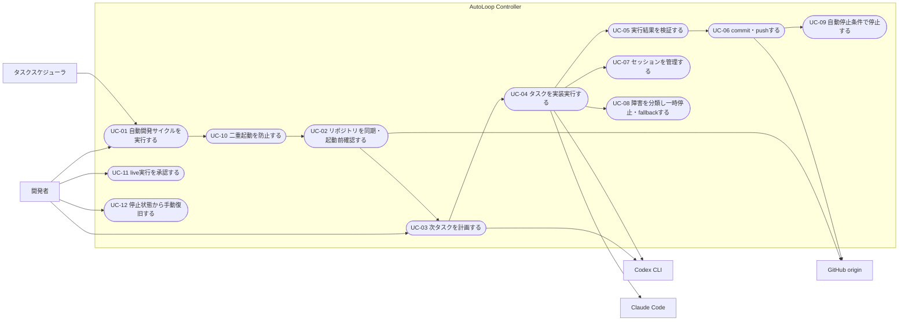

# USECASE.md — 汎用自動継続開発ランナーのユースケース定義

対象: `SPEC.md`(汎用自動継続開発ランナー仕様書 v0.1.0)
対象システム: AutoLoop Controller(Python / Windows 11 / PowerShell)

---

## 1. アクター

| アクター | 種別 | 説明 |
|---|---|---|
| 開発者(運用者) | 人間 | Controller を起動し、承認・復旧・指示書作成(Phase 1〜2)を行う |
| Codex CLI | 外部システム | Planner / Executor / Fallback Executor として非対話実行される AI Agent |
| Claude Code | 外部システム | Executor として非対話実行される AI Agent |
| GitHub(origin) | 外部システム | リモートリポジトリ。fetch / pull / push の対象 |
| タスクスケジューラ | 外部システム | Phase 5 で Controller を定期起動する(Windows) |

---

## 2. ユースケース図

図の `UC-01 → UC-10 → UC-02 → … → UC-09` は基本フローの実行順を示す。`開発者 → UC-03` は Phase 1〜2 で Planner を人間が代行する経路(QandA Q-01)。

---

## 3. ユースケース詳細

### UC-01 自動開発サイクルを実行する

| 項目 | 内容 |
|---|---|
| アクター | 開発者、タスクスケジューラ(Phase 5) |
| 概要 | IDLE→SYNCING→PREFLIGHT→PLANNING→PLAN_VERIFY→EXECUTING→RESULT_VERIFY→COMMITTING→PUSHING→NEXT_DECISION の状態遷移で 1 タスクを完了させ、条件により次サイクルへ進むか停止する(SPEC §8) |
| 事前条件 | lock が取得できる(UC-10)。`status: ready` の指示書が存在する(Phase 1〜2 は人間が事前作成)、または PLANNING で Planner が生成して `ready` にできる(Phase 3 以降) |
| 事後条件 | タスクが `completed` になり HEAD と origin/main が一致する、または停止状態(§18)へ移行する |
| 基本フロー | 1. lock 取得 → 2. 同期・起動前確認(UC-02) → 3. 計画(UC-03) → 4. 実行(UC-04) → 5. 検証(UC-05) → 6. commit・push(UC-06) → 7. NEXT_DECISION で継続可否を判定 |
| 代替フロー | READY_NEXT → PLANNING へ戻る(最大 5 タスク/起動)。APPROVAL_REQUIRED / BLOCKED / RELEASE_READY / FAILED → 停止(UC-09) |
| 備考 | 1 サイクルで実行する作業は 1 件のみ(SPEC §2.2) |

### UC-02 リポジトリを同期・起動前確認する

| 項目 | 内容 |
|---|---|
| アクター | Controller(内部)、GitHub |
| 概要 | git status / fetch / pull --ff-only / rev-parse / diff --check を実行し、実行開始可否を判定する(SPEC §9) |
| 事前条件 | lock 取得済み |
| 事後条件 | clean worktree かつ HEAD=origin/main で PLANNING へ進む |
| 基本フロー | 1. `git status --short` → 2. `git fetch origin main` → 3. `git pull --ff-only` → 4. HEAD と origin/main の一致確認 |
| 指示書検査 | 既存指示書を実行する場合(Phase 1〜2)は PREFLIGHT で `status: ready`・`expected_base_commit` 包含・task_id 二重実行を検査する。Planner が指示書を生成する場合(Phase 3 以降)は、PLANNING 後の PLAN_VERIFY で同じ検査を行う(QandA Q-04) |
| 例外フロー | dirty worktree → `PAUSED_DIRTY_WORKTREE`。ff 不可 / HEAD 不一致 / base commit 不含 / 完了済み task_id / status≠ready → 実行開始しない。reset・stash・clean による自動復旧は禁止 |

### UC-03 次タスクを計画する

| 項目 | 内容 |
|---|---|
| アクター | Codex CLI(Planner) ※Phase 1〜2 は開発者が代行(QandA Q-01) |
| 概要 | result.md / FIX_PLAN.md / hikitsugi.md / QandA.md / Git log 等を読み、次作業を 1 件決定して `instructions/instructions.md` を生成する(SPEC §12) |
| 事前条件 | PREFLIGHT 通過 |
| 事後条件 | `decision` が ready / approval_required / blocked / release_ready のいずれかで返り、ready の場合は Front Matter 付き指示書が存在する |
| 基本フロー | 1. 正本ファイル群を読む → 2. 次作業を 1 件選定 → 3. instructions.md を生成(YAML Front Matter 付き、SPEC §6) → 4. `{"decision":"ready","next_task_id":...}` を返す |
| 例外フロー | live 必要 → approval_required。仕様未確定 → blocked。リリース条件充足(SPEC §22) → release_ready。複数タスクを同時に ready にしてはならない |
| 制約 | Planner が変更できるのは原則 `instructions/instructions.md` のみ。結果は Planner 結果 Schema で検証する(PLAN_VERIFY) |

### UC-04 タスクを実装実行する

| 項目 | 内容 |
|---|---|
| アクター | Claude Code または Codex CLI(Executor) |
| 概要 | 指示書に従い、許可された範囲だけを変更し、指定テストを実行し、result.md へ結果を書く(SPEC §13) |
| 事前条件 | `status: ready` の指示書。PLAN_VERIFY 通過 |
| 事後条件 | `instructions/result.md` に対象 task_id の完全な機械可読ブロック(SPEC §7)が追記されている |
| 基本フロー | 1. 非対話モードで Agent 起動(初回)または session ID 指定で resume(SPEC §11) → 2. 指示書・preflight 結果を確認 → 3. allowed_paths 内のみ変更 → 4. required_tests を実行 → 5. `git diff --check` → 6. result.md へ結果ブロック追記 → 7. 終了 |
| 例外フロー | usage_limit / context_limit / transient_error / authentication_error / safety_classifier_unavailable → UC-08 へ |
| 禁止事項 | 指示書にない追加実装、live 評価、ファイル削除(SPEC §3.2、必要時は approval_required)、`git add .`、reset・stash・clean、force push、次タスクの実装開始 |
| 備考 | result.md の結果ブロック中 `result_commit` は Executor 時点では未確定のため null とし、確定 SHA は Controller が logs/result.json と state.json に記録する(QandA Q-03) |

### UC-05 実行結果を検証する

| 項目 | 内容 |
|---|---|
| アクター | Controller(内部、Verifier) |
| 概要 | ファイル・テスト・Git の 3 観点で Agent の作業結果を検証する(SPEC §14) |
| 事前条件 | Agent が終了している |
| 事後条件 | 検証成功で COMMITTING へ。失敗時は commit しない |
| 基本フロー | 1. 変更ファイルが allowed_paths 内か確認 → 2. 禁止ファイル(生 stdout・artifact 等)混入なし → 3. result.md に完全な結果ブロックあり → 4. 指定テスト全実行・exit code 0・件数一致 → 5. `git diff --check` ほか Git 検証 |
| 例外フロー | allowed_paths 外の変更 → `unexpected_change` で停止(SPEC §6.3)。結果ブロックが開始マーカーのみ → 途中書き込みとして自動続行しない(SPEC §7)。テスト失敗 → 停止(§18) |

### UC-06 commit・pushする

| 項目 | 内容 |
|---|---|
| アクター | Controller(内部、Git Publisher)、GitHub |
| 概要 | 許可された個別ファイルだけを stage し、commit・push して一致確認する(SPEC §15) |
| 事前条件 | RESULT_VERIFY 通過 |
| 事後条件 | HEAD=origin/main かつ clean worktree → タスクを `completed` にする |
| 基本フロー | 1. `git add -- <個別ファイル>` → 2. commit(指示書の commit_message) → 3. `git push origin main` → 4. HEAD と origin/main の一致確認 |
| 例外フロー | push 失敗 / 不一致 → 停止(§18) |
| 禁止事項 | `git add .` / `git add -A` / `git commit -a` / `git push --force` |

### UC-07 セッションを管理する

| 項目 | 内容 |
|---|---|
| アクター | Controller(内部、Session Manager) |
| 概要 | session ID の取得・保存・resume・rotation を行う(SPEC §10) |
| 基本フロー | 1. 初回出力から session ID を取得し state.json へ保存 → 2. 以後は ID を明示して resume → 3. resume 時は共通指示(Git とファイルを正本、重複実行禁止)を渡す |
| 代替フロー(rotation) | context limit 検出 / resume 回数超過 / 同一セッション 5 タスク処理 / task_id 系列変更 / 前回状態取得不能 / Agent の新規推奨 / リリース前独立レビュー → 新規セッションを作成し、Git と引継ぎファイルから状態を復元 |
| 禁止事項 | 無人運転で `--last` / `--continue` だけに依存すること(手動復旧時のみ可) |

### UC-08 障害を分類し一時停止・fallbackする

| 項目 | 内容 |
|---|---|
| アクター | Controller(内部)、Codex CLI / Claude Code(fallback 先) |
| 概要 | 終了コード・構造化 stdout・stderr・Git 状態から障害を分類し、対応する(SPEC §16) |
| 分類と処理 | usage_limit → 差分保存・`PAUSED_USAGE_LIMIT`・fallback 可なら別 Agent へ引継ぎ(SPEC §17)/ context_limit → 同一 Agent の新セッションへ rotation / transient_error → 30 秒・120 秒待機で最大 2 回 resume、3 回目は停止か fallback / authentication_error → 自動復旧せず停止 / safety_classifier_unavailable → 読み取りのみ継続可、実装・commit が必要なら停止 |
| 引継ぎ | 会話コンテキストは渡さず、Git diff・instructions.md・result.md・hikitsugi.md・停止分類・実行済みテスト一覧を正本に引継ぎプロンプトを生成する |
| 禁止事項 | 失敗した live 実行の自動再試行 |

### UC-09 自動停止条件で停止する

| 項目 | 内容 |
|---|---|
| アクター | Controller(内部) |
| 概要 | SPEC §18 の停止条件のいずれかを検出したら必ず停止する |
| 主な条件 | approval_required / blocked / release_ready / 予期せぬ dirty worktree / 許可外ファイル変更 / テスト失敗 / 同一原因の連続 2 回テスト失敗 / task_id 二重実行 / resume 回数超過 / 制限時間超過 / 5 タスク完了 / 連続 2 タスク失敗 / main と origin/main の不一致 / push 失敗 / 認証エラー / live 実行が必要 / Planner が次作業を一意に決められない |
| 事後条件 | 状態と理由を state.json・ログに記録して終了する |

### UC-10 二重起動を防止する

| 項目 | 内容 |
|---|---|
| アクター | Controller(内部) |
| 概要 | 起動時に `runner.lock`(pid / hostname / started_at / task_id)を作成する(SPEC §20) |
| 例外フロー | 既存 PID が生存 → 新しい Controller は終了。PID が存在しない古い lock → ログを残して stale lock として解除できる |

### UC-11 live実行を承認する

| 項目 | 内容 |
|---|---|
| アクター | 開発者 |
| 概要 | Planner が `approval_required` を返した live 作業(SPEC §19)を人間が承認し、新しい指示書 revision を commit する |
| 事前条件 | `approval_required` で停止している |
| 事後条件 | 承認済み指示書(task_revision 更新)が commit され、次回起動で実行可能になる |
| 備考 | Phase 6 で本格実装。MVP では live は全面禁止(SPEC §25) |

### UC-12 停止状態から手動復旧する

| 項目 | 内容 |
|---|---|
| アクター | 開発者 |
| 概要 | PAUSED_* や FAILED で停止した Controller の原因を解消し、再起動する |
| 基本フロー | 1. ログ(logs/YYYYMMDD-HHMMSS/)と state.json を確認 → 2. 原因を解消(認証再ログイン、worktree 整理、指示書修正など) → 3. Controller を再起動(Agent 停止後の再開は同じ session ID の resume を利用可能) |
| 備考 | 手動復旧時のみ `--last` / `--continue` を使用してよい(SPEC §10.2) |

---

## 4. MVP フェーズとユースケースの対応

| フェーズ(SPEC §23) | 有効になるユースケース |
|---|---|
| Phase 1 単一タスク実行 | UC-01(1 タスクのみ)、UC-02、UC-04(初回起動のみ)、UC-05、UC-06、UC-10 |
| Phase 2 session resume | UC-07 |
| Phase 3 Planner 追加 | UC-03 |
| Phase 4 Agent fallback | UC-08(fallback 引継ぎ) |
| Phase 5 連続運転 | UC-01(最大 5 タスク)、UC-09 全条件、タスクスケジューラ起動 |
| Phase 6 live 承認ゲート | UC-11 |
